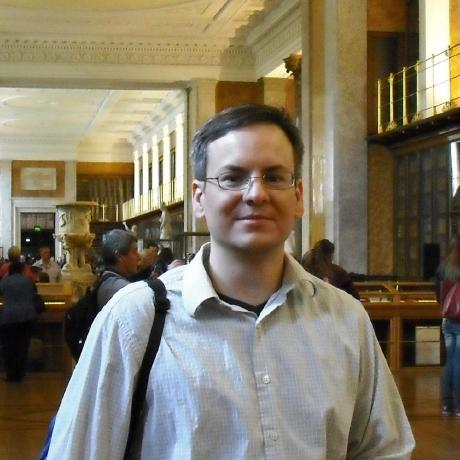

### Welcome!

I am a senior staff member of the [Johns Hopkins Applied Physics Laboratory](http://www.jhuapl.edu) where I am a member of the machine learning group within the [Research and Exploratory Development Department]( http://www.jhuapl.edu/ourwork/red/default.asp).
My work here consists of developing software, algorithms, models, and simulations to solve scientific problems. 
These days, this primarily involves developing and applying machine learning techniques to solve problems of interest to our sponsors.  

I am also currently a part-time student (PhD candidate) at the University of Maryland College Park in the [Applied Mathematics & Statistics, and Scientific Computation program](http://www.amsc.umd.edu).
Here I am collaborating with members of the Norbert Wiener Center for Harmonic Analysis on problems that lie at the intersection of deep learning and applied mathematics.

